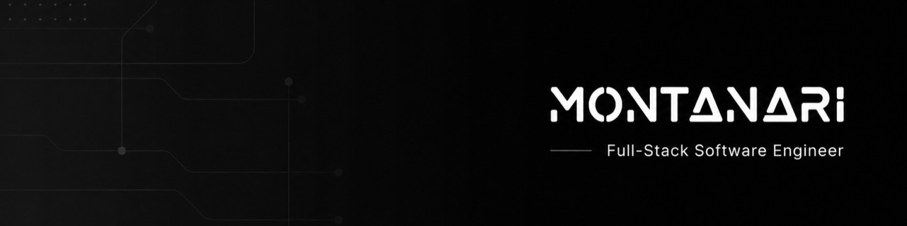
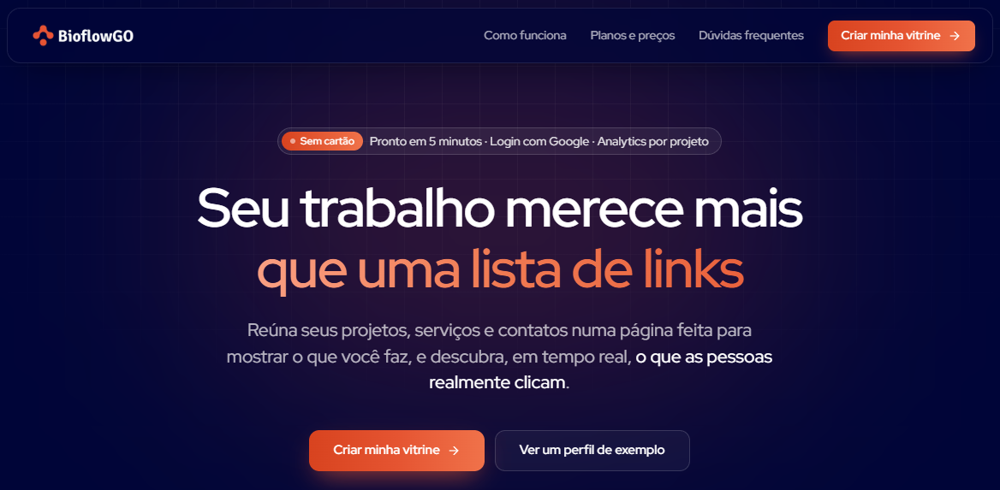

  

<h1 align="center">Renan Montanari</h1>

  

  Do problema ao produto no ar: arquitetura, código e deploy 
  com uma pessoa só responsável pelo resultado.

  
  
  
  

  
  

 

## 👨‍💻 Sobre

Trabalho em todas as camadas de um produto: **modelagem de dados, API, interface, autenticação e o deploy** que coloca tudo no ar.

No backend, projeto APIs com Node.js e NestJS pensando em contratos claros, segurança e limites bem definidos entre módulos. No frontend, construo interfaces rápidas e acessíveis com React e Next.js. E cuido do que costuma ficar sem dono em projeto pequeno: banco, autenticação, observabilidade e infraestrutura.

> [!NOTE]
> O que me diferencia não é o que eu sei, é **como eu decido**. Antes da primeira linha eu já estou pensando em escalabilidade, manutenção e no desenvolvedor que vai dar suporte depois. A escolha mais inteligente quase nunca é a mais nova; é a que você ainda consegue explicar daqui a um ano.

 

## 🚀 BioflowGO — produto próprio, em produção

  

Plataforma SaaS de link na bio para o mercado brasileiro: página personalizada, analytics de visitantes e plano pago com Stripe. Construí **do schema do banco ao deploy**: autenticação OAuth, billing recorrente, painel e infraestrutura.

<table>
  <tr>
    <td width="33%" valign="top">
      <strong>🔐 Auth</strong> 
      Login com Google via NextAuth.js, sessões e rotas protegidas por middleware.
    </td>
    <td width="33%" valign="top">
      <strong>💳 Billing</strong> 
      Assinatura recorrente com Stripe, trial de 7 dias e webhooks.
    </td>
    <td width="33%" valign="top">
      <strong>📊 Analytics</strong> 
      Visitas e cliques por projeto, em tempo real, no painel do usuário.
    </td>
  </tr>
</table>

`Next.js 15` · `TypeScript` · `Prisma` · `PostgreSQL` · `NextAuth.js` · `Stripe` · `Vercel`

  
  

O estudo de caso cobre decisões de arquitetura, trade-offs e o que eu faria diferente.

 

## 🧩 O que eu construo

<table>
  <tr>
    <td width="50%" valign="top">
      <h4>🔐 Autenticação e permissões</h4>
      Login social, e-mail, sessões seguras e RBAC, feito uma vez do jeito certo, em vez de remendado depois do primeiro incidente.
    </td>
    <td width="50%" valign="top">
      <h4>💳 Pagamentos e assinaturas</h4>
      Checkout, planos, upgrades e webhooks com Stripe. Cobrança recorrente é onde MVP costuma quebrar.
    </td>
  </tr>
  <tr>
    <td width="50%" valign="top">
      <h4>📊 Painéis e áreas logadas</h4>
      Dashboards e ferramentas internas que substituem planilha compartilhada, com dado consistente e histórico confiável.
    </td>
    <td width="50%" valign="top">
      <h4>🔌 APIs e integrações</h4>
      WhatsApp, gateways, ERPs e serviços de terceiros, com tratamento de falha e reprocessamento.
    </td>
  </tr>
  <tr>
    <td width="50%" valign="top">
      <h4>⚡ Tempo real</h4>
      Notificações, chat e atualização ao vivo com WebSocket, onde recarregar a página não é aceitável.
    </td>
    <td width="50%" valign="top">
      <h4>🔎 Performance e SEO</h4>
      Renderização adequada a cada página, Core Web Vitals e indexação, para o produto ser encontrado, não só existir.
    </td>
  </tr>
</table>

 

## 🛠️ Stack

<table>
  <tr>
    <td align="center" width="130"><strong>Frontend</strong></td>
    <td></td>
  </tr>
  <tr>
    <td align="center"><strong>Backend & dados</strong></td>
    <td></td>
  </tr>
  <tr>
    <td align="center"><strong>Infra</strong></td>
    <td></td>
  </tr>
</table>

Também uso no dia a dia: Drizzle ORM, Auth.js, Better Auth, Zod e Vitest.

 

## 🧭 Como eu trabalho

| | Princípio | Na prática |
| :-: | --- | --- |
| **01** | **Escopo antes do código** | Decidir o que fica de fora da primeira versão é o que mais economiza dinheiro no projeto inteiro. |
| **02** | **TypeScript estrito** | Sem `any`, sem atalho que vira dívida no sprint seguinte. |
| **03** | **Código desacoplado e testável** | Limites explícitos entre módulos, para que trocar uma peça não derrube três. |
| **04** | **Entrega semanal em ambiente real** | Algo navegável para clicar, não print. Mudança de rumo custa barato quando é cedo. |
| **05** | **No ar e seu** | Deploy, domínio, banco e acessos no nome do cliente. Se ele trocar de dev amanhã, o próximo entra sem depender de mim. |

 

## 💬 Vamos conversar

Me conte o que você quer construir e em que estágio está: ideia no papel, protótipo pronto ou sistema já rodando. Respondo pessoalmente em até um dia útil, com uma opinião honesta sobre a viabilidade antes de qualquer proposta.

  
  

